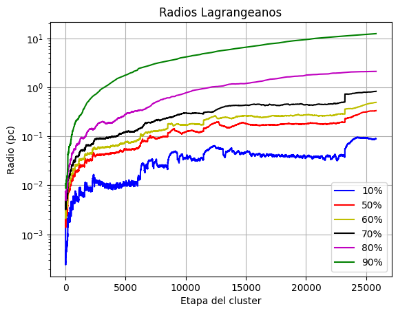
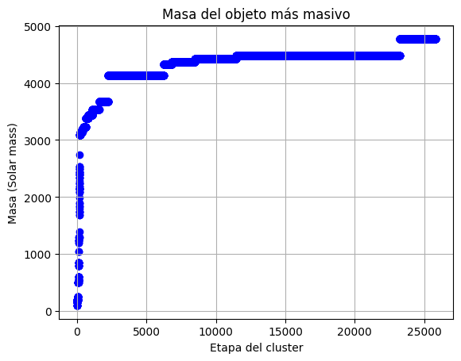
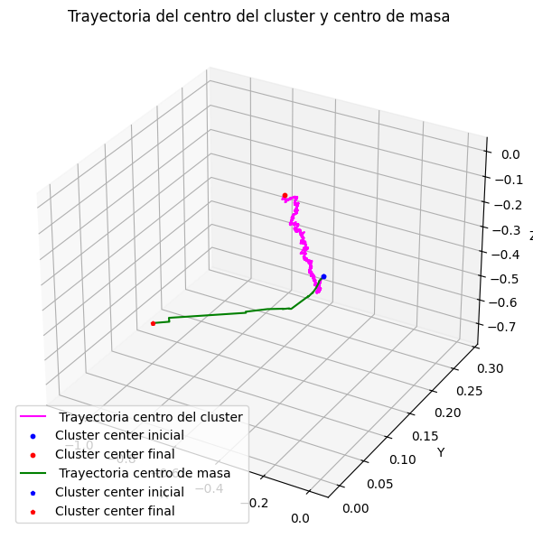
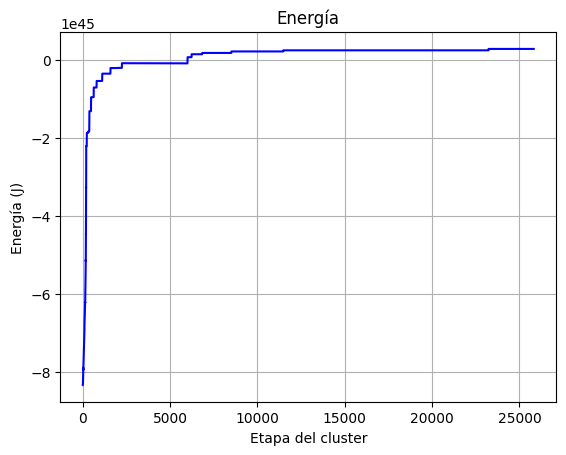

# Colapso gravitacional de un cúmulo estelar

Análisis de una simulación de N cuerpos de un cúmulo de **2.000 estrellas** a lo largo de **25.817 instantes**, hecho con [AMUSE](https://amuse.readthedocs.io/). Estudiamos cómo evoluciona la estructura del cúmulo: su centro, cómo se distribuye la masa y su energía. Fue el proyecto final del curso **CD2201 Módulo Interdisciplinario** (Plan Común, FCFM, Universidad de Chile, diciembre de 2024), y lo presentamos como el equipo *Profeta Galáctico*.

  
  

## Objetivos

- **Centro del cúmulo.** Seguir el centro del cúmulo $\vec r_{cc}$ y compararlo con el centro de masa. Para el centro usamos la definición de Makino y Sugimoto (1987), que pondera cada estrella por la densidad local, estimada con la distancia a su sexto vecino más cercano:

  $$\vec r_{cc} = \frac{\sum_i \vec r_i / r_{6,i}^3}{\sum_i 1 / r_{6,i}^3}.$$

- **Radios lagrangianos.** Calcular $r_\xi$, el radio (centrado en $\vec r_{cc}$) que encierra el $\xi\%$ de la masa total, para $\xi = 10, 50, \dots, 90$.
- **Energía y relajación.** Seguir la energía del sistema, el tiempo de relajación $T_{\text{relax}} = \frac{N}{6\ln N}\, t_{cr}$ y la trayectoria y masa del objeto más masivo.

## Metodología

- **Datos.** Una snapshot HDF5 por instante con posiciones, velocidades y masas, leídas con `h5py` y `amuse.io`. Los datos de la simulación los facilitó Boris Cuevas.
- **Rendimiento.** Procesar las 25.817 snapshots tomaba unas 6 horas. Repartiendo el trabajo con `multiprocessing` en los núcleos disponibles en Colab bajó a unas 2 h 40 min. Usamos `logging` para monitorear el avance.
- **Salida.** Las cantidades derivadas quedan en archivos CSV (`processed data .csv`, `processed data 2.csv`) para graficar sin reprocesar.

## Resultados principales

- El objeto más masivo se mantiene cerca del centro del cúmulo y su masa crece por colisiones sucesivas hasta unas **4.700 masas solares**.
- Los radios lagrangianos crecen en varios órdenes de magnitud y la energía total aumenta: después de las colisiones internas el cúmulo se expande, y la masa queda concentrada en un objeto central.
- El cúmulo parte muy compacto y caótico, y hacia el final de la simulación se acerca al equilibrio.

  
  

## Archivos

| Archivo | Descripción |
|---|---|
| [`Proyecto_Colapso_Gravitacional.ipynb`](Proyecto_Colapso_Gravitacional.ipynb) | Notebook con el procesamiento y los gráficos |
| [`Presentación_Final_Módulo.pdf`](Presentación_Final_Módulo.pdf) | Presentación final |
| [`Informe_Proyecto_Final_CD2201_16.pdf`](Informe_Proyecto_Final_CD2201_16.pdf) | Informe del proyecto |
| [`Profeta Galáctico.pdf`](Profeta%20Galáctico.pdf) | Propuesta inicial del proyecto |
| `processed data*.csv` | Cantidades derivadas por instante |
| `Base de datos` | Enlace a los datos crudos de la simulación |

## Equipo

M. González, M. Maturana, E. Reyes y C. Riquelme.

## Referencias

- J. Makino, D. Sugimoto (1987). *Effect of suprathermal particles on gravothermal oscillation*.
- A. Escala (2021). The Astrophysical Journal, 908:57.
